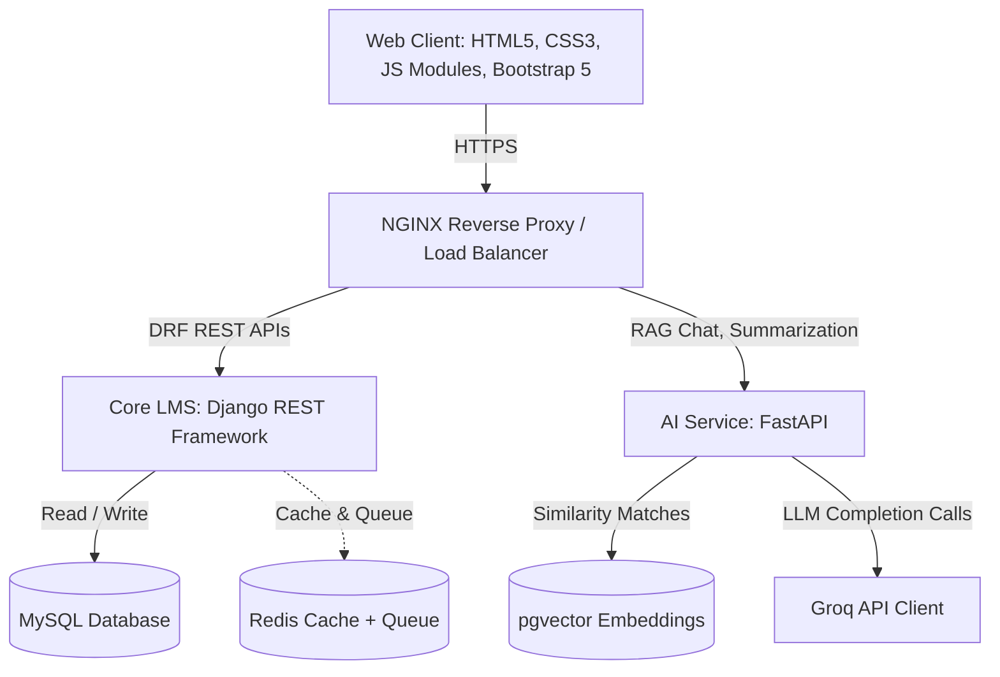

# VertexLearn AI - Learning Management System Foundation

VertexLearn AI is a production-quality, enterprise-grade e-learning management platform. It coordinates conventional course authoring, lecture streams, and assignment submissions with a FastAPI Retrieval-Augmented Generation (RAG) AI tutor grounded in course materials.

This package represents the complete foundation of the system, laying out the folder structure, database models, modular JavaScript controllers, CSS theme styles, layouts, and route protection systems.

---

## 1. System Architecture



---

## 2. Directory Structure

The project has been organized into a modular monorepo directory layout:

```text
vertexlearn-ai/
├── frontend/                     # Frontend Application
│   ├── assets/
│   │   ├── css/
│   │   │   ├── base/             # Reset, Variables, and Typography
│   │   │   ├── components/       # Buttons, Cards, Forms, Tables, etc.
│   │   │   ├── layout/           # Sidebar, Sticky Header, and Footer
│   │   │   ├── themes/           # Dark Mode class overrides
│   │   │   └── utilities/        # Responsive media queries
│   │   └── js/
│   │       ├── config/           # API fetch client, Constants, Router Guard, Storage
│   │       ├── utils/            # Debounce/Throttle, Formatters, Validators
│   │       └── components/       # Navbar toggles, Sidebar collapsible drawers, Toast, Loader, Modals
│   ├── index.html                # Public Landing Page
│   ├── login.html                # Auth Page
│   ├── register.html             # Signup Page
│   ├── student.html              # Student Workspace Layout Shell
│   ├── instructor.html           # Instructor Authoring Workspace Layout Shell
│   ├── admin.html                # Platform Governance Layout Shell
│   ├── player.html               # Course Player Video Split-Pane Layout
│   └── 404.html                  # Error Splash Pages
│
├── backend/                      # Django REST Framework Service
│   ├── config/                   # WSGI, URL routing, and settings (MySQL + DRF SimpleJWT)
│   ├── apps/                     # Modular Django Apps
│   │   ├── authentication/       # JWT logins
│   │   ├── users/                # Users, roles, and profiles
│   │   ├── courses/              # Courses, modules, and lectures
│   │   ├── enrollments/          # Course progress, notes, and bookmarks
│   │   ├── assignments/          # Assignments and student submissions
│   │   └── quizzes/              # Quizzes, questions, options, attempts, and answers
│   └── requirements.txt          # Python requirements dependencies
│
└── ai-service/                   # FastAPI AI Tutor Service
    ├── app/
    │   ├── routers/              # Chat routers and message schemas
    │   ├── rag/                  # Chunking and retriever pipelines
    │   └── main.py               # FastAPI bootstrapper
    └── requirements.txt          # AI service requirements
```

---

## 3. Technology Stack & Framework Configurations

### Frontend
- **Bootstrap 5 & Vanilla CSS**: Overriding default variables inside `:root` to enforce brand design tokens without needing Sass compiles.
- **ES6 Modules**: High-performance modular scripting (`type="module"`) that loads code directly in browser windows.
- **Inter Font**: Inter font hierarchy mapped to standard tag properties (`.text-hero` to `.text-xs`).

### Backend (Django)
- **Django REST Framework**: Coordinates REST APIs using JWT authorization credentials.
- **MySQL Driver Injection**: Configures settings for MySQL using `pymysql` driver wrappers.
- **DDL Mapping**: Python models under `apps/` match the exact columns, indexes, and cascades outlined in the PRD.

### AI Service (FastAPI)
- **FastAPI**: Minimizes latency for streaming LLM outputs.
- **Groq API & RAG**: Pre-configures message routers containing schema shapes with source citations, structured prompts, and mock vectors.

---

## 4. Run & Test Instructions

### Frontend Sandbox
To launch and review the frontend layouts without installing Python dependencies:
1. Navigate to the `frontend/` directory.
2. Launch a local web server (e.g. VS Code Live Server, or `npx http-server`).
3. Open `index.html` in your browser.
4. Click **Get Started** or **Sign In**.
5. In the **Sandbox Demo Login Profile** dropdown, select a user profile (Student, Instructor, or Admin) to log in instantly. The routing guard will redirect you to the corresponding role dashboard.
6. Toggle Light and Dark mode using the button in the sidebar or header.

### Backend Setup (Django)
```bash
cd backend
python -m venv venv
venv\Scripts\activate
pip install -r requirements.txt
python manage.py makemigrations
python manage.py migrate
python manage.py runserver
```

### AI Service Setup (FastAPI)
```bash
cd ai-service
python -m venv venv
venv\Scripts\activate
pip install -r requirements.txt
uvicorn app.main:app --reload --port 8001
```

---

## 5. Key Architecture Features

1. **Silent JWT Refresh Interceptors**: `api.js` catches expired token states, requests a refresh token, resolves it, and replays queued requests without disrupting user interactions.
2. **Instant Theme Switching**: Synced class controls on `<html>` mapping to LocalStorage preferences, avoiding flashes.
3. **Route Protections**: `router.js` evaluates local storage tokens and role memberships, blocking unauthorized users.
4. **Programmatic Components**: JavaScript modal confirmations, loader animations, and toast notification queues are fully detached and reusable.
